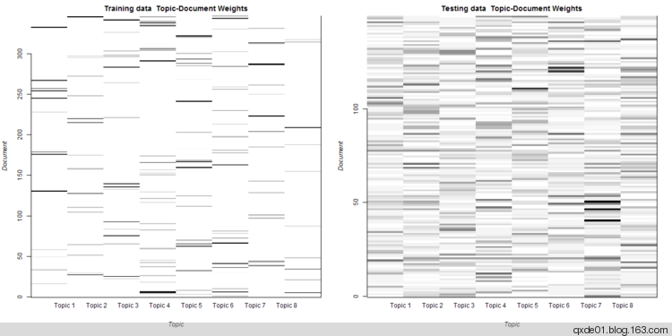

创建自然语言的[主题模型（topic model）](https://en.wikipedia.org/wiki/Topic_model),目前比较著名的是[LDA（Latent Dirichlet allocation）](https://en.wikipedia.org/wiki/Latent_Dirichlet_allocation) ，在R语言中，有两个包（package）提供了LDA模型：`lda`和`topicmodels`。`lda`提供了基于Gibbs采样的经典LDA、MMSB（the mixed-membership stochastic blockmodel )、RTM（Relational Topic Model）和基于VEM（variational expectation-maximization）的sLDA( supervisedLDA)、RTM。`topicmodels`基于包`tm`，提供LDA\_VEM、LDA\_Gibbs、CTM_VEM（correlated topics model）三种模型。另外包`textir`也提供了其他类型的主题模型。
<!--more-->
关于主题模型和LDA的原理网络上有大把的文章和论文，本文仅限于 _topicmodels_ 包的使用和LDA建模的一些讨论。

*   ** 文本数据的获取与分词**

本文使用的数据为电影《 [云图](http://movie.douban.com/subject/3530403/) 》在豆瓣上的长篇评论文章，目前有两千多篇影评，只获取500篇（多了破电脑处理不了），然后使用 _Rwordseg_ 进行分词。在网络上找到一些停止词词汇、情感的正面和负面词汇，在分词后，过滤掉停止词，分别提取了正面词汇和负面词汇。

豆瓣影评的获取方法参 [见前一篇博文](http://qxde01.blog.163.com/blog/static/6733574420132915952828/) 。

《云图》在豆瓣的总评分为8.0，评分不俗，这部电影需要聚精会神地观看，稍不留神就对不上了。在获取的500篇影评中，有评分记录的494篇，评5分的219篇，评4分的190篇，评3分的81篇。

在去掉数字和字母之后，有效数据 346+149=495篇。

*   **LDA主题建模**

将这500篇数据分为350篇的训练集和150篇的测试集。

LDA类似于聚类，属于无监督学习，通常需要事先设定主题的数量。除了利用经验的方法设定外，一个常用的方式是计算模型的困惑度（perplexity），相对地讲，困惑度越小，LDA模型越优，模型的泛化能力越强，但是在实际应用中往往并非如此。还可以利用主题的平均相似度评估模型。

将主题数设置2～25，使用LDA_VEM模型，其困惑度如下图，不幸的是，困惑度的变化趋势并不像论文呈现的那样有完美的拐点，而是一直处于下降的趋势，测试集的困惑度是上升的变化趋势，很难利用困惑度确定主题数。

注意函数 posterior 具有预测功能，其中 posterior(object, newdata) 的 object 是一个 TopicModel ， newdata 是一个 DocumentTermMatrix 。

LDA模型的参数alpha估计随着主题数的增多而减小，比默认值要小，表明对于Dirichlet分布数据集，文档倾向于少量主题。

文档-主题的信息熵在主题数k为8时，达到最大值，比较此处的困惑度，困惑度的变化率越来越小，我们不妨认定k=8时是最优模型。

训练集和测试集一共出现词汇15110，前者13344个，后者6535个，而相同的只有4769个，测试集中有1766个词汇不在训练集中，训练集太少，训练的模型可用性较差。

*   **文档-主题分布 **

下图展示了所有文档主题概率分布，颜色越深，表示属于该主题的概率越高。对于训练集，大多数样本都可以归属到一个突出的主题，但也有不少样本归属不明显，对于测试集的预测效果更差。 alpha初始值不同的情况下， 每次运行结果可能不一样，有时差别可能很大。

从训练集中随机抽取10个样本，显示主题的概率（权重）分布，如下图。每个主题用权重最高的5个词汇表示，虽然每个文档的主题归属相当明显，图中的长条越长，表示归属该主题的可能性越高，但是主题之间相同的词汇相当多。而在测试集随机抽取的10个样本中，许多样本主题归属并不明显。

抽取每个主题阈值在0.002以上的前10个词汇，绘制成网络图，如下图，从左至右分别是2个主题、5个主题、8个主题，可以发现主题之间相同的词汇相当多，从前10个词汇来看，有的主题之间区别不明显。

*   **模型比较**

对495篇影评分别建立LDA\_VEM、 LDA\_VEM\_fixed、LDA\_Gibbs、CTM四种模型，设主题数k=8，得到四种模型对文档分配给最有可能的主题的概率分布图如下，很容易看出 LDA_VEM模型的概率值集中于1附近，也就是说绝大多数的文档都有一个可能性非常大的主题归属，而其他三个模型概率比较分散，实际上 LDA_VEM的困惑度也是最小的 。

根据主题归属合并词频矩阵，  LDA_VEM、  LDA_Gibbs的主题余玄相似度如下图，颜色越浅（偏黄色）相似度越高， LDA_Gibbs主题之间的差异性比 LDA_VEM要小。

*   ** 小结**

1.  如果要训练一个主题模型用于预测，数据量要足够大；
2.  理论上讲，词汇长度越长，表达的主题越明确，这需要一个优秀的词库；
3.  如果想要主题划分的更细或突出专业主题，需要专业的词典；
4.  LDA的参数alpha对计算效率和模型结果影响非常大，选择合适的alpha可以提高效率和模型可靠性；
5.  主题数的确定没有特别突出的方法，更多需要经验；
6.  根据时间轴探测热点话题和话题趋势，主题模型是一个不错的选择；
7.  前面提到的正面词汇和负面词汇，如何利用，本文没有找到合适的方法；
8.  代码围观: [Github](https://github.com/qxde01/myRproj/tree/master/CloudAtlas)   (代码和数据有更新，结果和本文描述有差异，基本过程没有变化)
