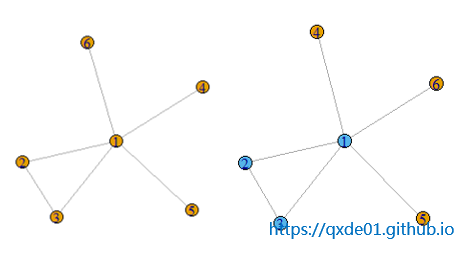
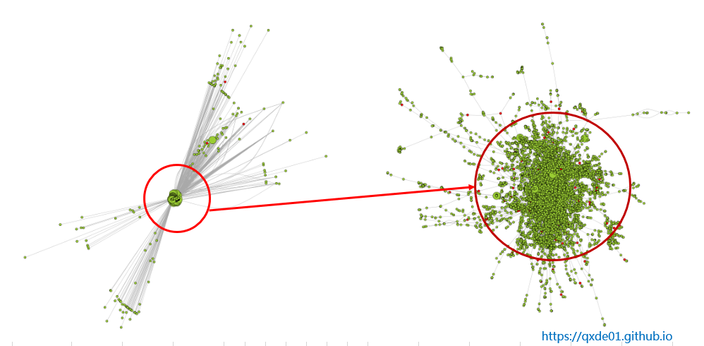
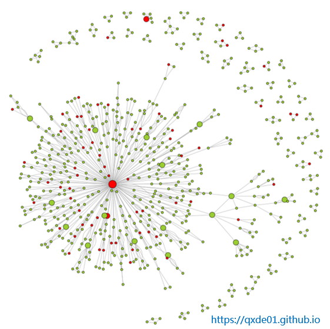
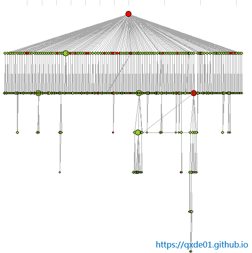
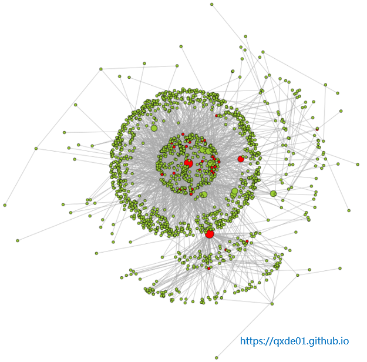
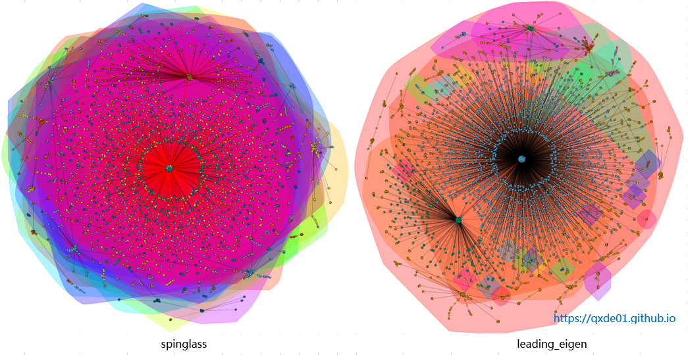
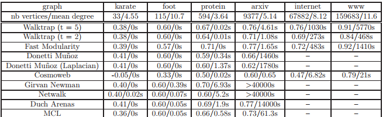

>利用cliques方法，介绍在一个大型网络图中发现欺诈团伙的过程，主要应用场景在金融反欺诈领域。
<!--more-->
### 1 **k-Clique**
 [Clique](https://en.wikipedia.org/wiki/Clique)中文称为团或派系，对于一个图G而言，如果其中有一个完全子图（任意两个节点之间均存在边），节点数是k，那么这个完全子图就可称为一个k-clique。3-clique图是一个三角形，两两节点相连。本文将基于3-clique识别小团体网络。
 
另外，经典的最大团问题（Maximum Clique Problem, MCP）是图论中一个组合优化问题，也是一类NP完全问题。

### 2 **确定关系（边）**
要解决什么样的问题，用什么样的数据构建一个图，这是首先要明确的问题。比如用通话记录构建一个图，什么样的号码需要保留，外卖和快递小哥的号码要不要保留，这取决于要解决的问题，然后指定清洗策略，数据预处理的过程也就是图数据准备得过程，也是关系确定的过程，一般用sql就可以搞定了。
目前运营商的数据是非常容易获取的，可以从许多第三方公司获取，当然需要用户授权和业务绑定。另外，看看手机上安装的app数据采集信息，无论有没有业务相关性，一般都有通信录、通话记录、短信、位置等信息访问，如果禁掉这些权限是就是真的禁掉吗？！

### 3 **欺诈网络团伙发现**
原始网络有2万多条边和2万多个节点组成，入下图所示，该网络中有400多个“坏节点”。75%的节点出入度是1，边密度（edge_density）只有0.000102，平均closeness是0.18，整体上是非常稀疏的。

使用`igraph::cliques`函数，发现该网络有295个3-clique，2个4-clique。使用3-clique提取的节点只有671个，只占原网络的3.33%。由3-clique组成的子图中，有52个独立的子图，超过1半的子图是只有3个节点的三角网络，其中最大一个子图有482个节点，包含39个“坏节点”，该子图平均closeness是0.27，关系“亲密”多了。

该子网络有个中心节点，是一个大大的“坏节点”，该节点的出入度占整体出入度的10%，有131个一度“好友”关系，“坏节点”有19个，占该网络中坏节点的48.72%，二度“坏节点”占43.60%，是名副其实的“坏网络”，而且是一个大型“坏网络”。

### 4 **社群发现**
对原始网络使用社群发现的方法进行聚类，walkstrap可以聚类将近3000个子网络，大多数是小网络；而用spinglass只聚出25个网络，节点数几乎是平均分配的。label propagating方法结果和walkstrap类似，以小网络为主。特征值分解（leading_eigen）方法聚类结果群体并不多，但是大的非常大，小的非常小，非常偏态。

### 5 **小结**
+ Clique方法发现的子图，密度大，节点之间联系紧密，应用上准确率高，但是对于全网络来说，只保留少量的节点，覆盖率低。
+ 社群发现的方法，不同的算法结果差异很大，基本上可以覆盖所有节点，但准确率相对较低，谨慎选择算法和评估策略。在反欺诈领域，以[小世界网络](https://zh.wikipedia.org/zh-hans/%E5%B0%8F%E4%B8%96%E7%95%8C%E7%B6%B2%E8%B7%AF)应用为主，综合性能和效果，还是walkstrap首选,下表摘自论文。
