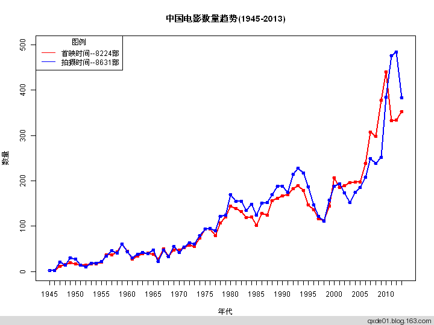
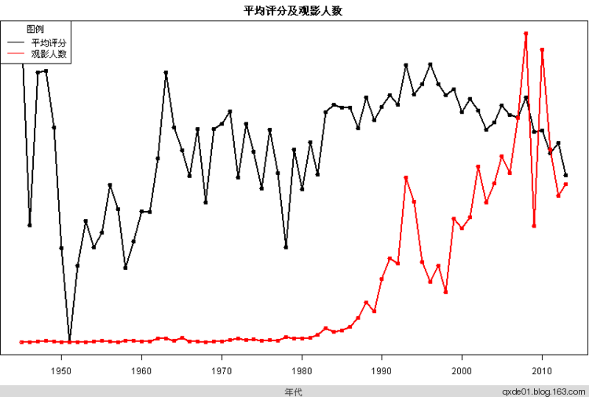
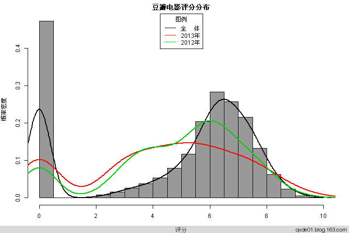
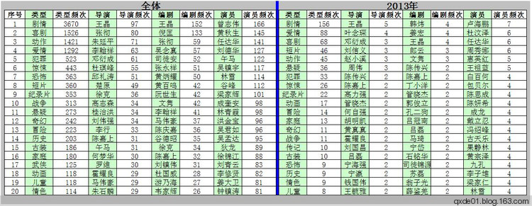
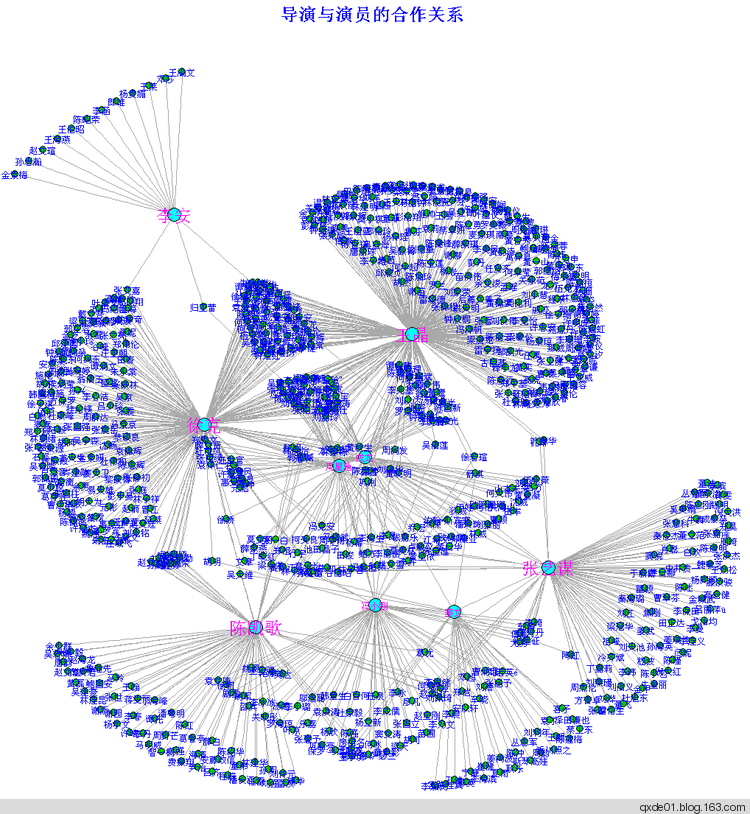
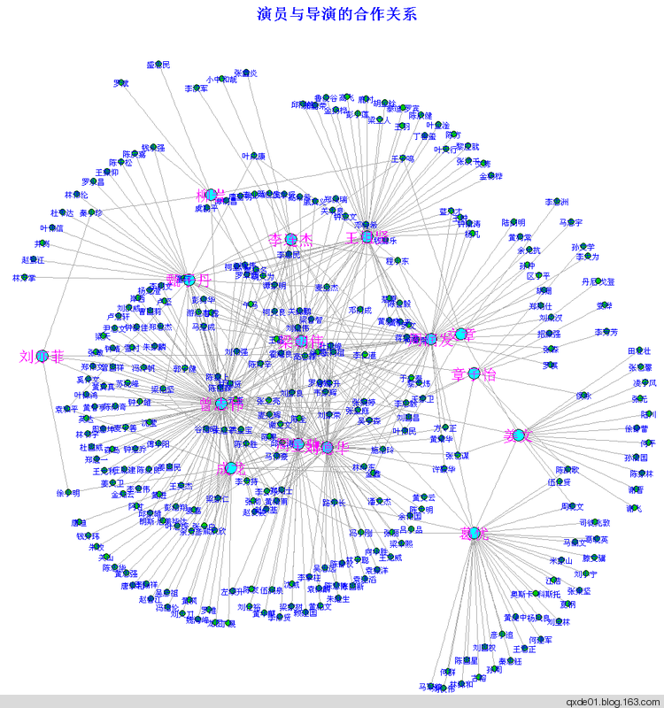

【从网易博客迁移，本文写于2014年1月】

好功夫是没有用的，感情这种事啊，功夫再好也是挡不住的。《中南海保镖》
天下风云出我辈，一入江湖岁月催。《东方不败》
我代表党，代表人民宣判你的死刑。《党的女儿》
梦想始于剧本，而终结于电影。——乔治·卢卡斯

<!--more-->

豆瓣电影已经累计大量的电影资料，通过获取其中一些简单的信息，可以大致了解中国电影的状况。当你回顾中国电影百年历史时，蓦然发现，将中国电影推向世界以及支撑中国电影发展的是港台电影，再进一步地说是香港电影。

**1\. 数据来源**  

根据豆瓣电影的标签，获取包含标签为“[中国电影](http://movie.douban.com/tag/%E4%B8%AD%E5%9B%BD%E7%94%B5%E5%BD%B1)”、“[台湾电影](http://movie.douban.com/tag/%E5%8F%B0%E6%B9%BE%E7%94%B5%E5%BD%B1)”、“[香港电影](http://movie.douban.com/tag/%E9%A6%99%E6%B8%AF%E7%94%B5%E5%BD%B1)”、“[大陆电影](http://movie.douban.com/tag/%E5%A4%A7%E9%99%86%E7%94%B5%E5%BD%B1)”、“[国产电影](http://movie.douban.com/tag/%E5%9B%BD%E4%BA%A7%E7%94%B5%E5%BD%B1)”的电影，注意的是，获取的数据不一定完全是中国电影，也有可能是电视剧和国外电影，所以经过去重复、电视剧和国外电影排除，这样得到10855部电影的数据，但仍然不能保证数据是完全纯正的，个别电影可能不是我们需要，这类异常数据排除非常困难，好在不会影响分析结果。获取的数据信息包含：

> *   movieid：豆瓣电影ID
> *   title：电影名称
> *   director：导演
> *   writer：编剧
> *   cast：主要演员 
> *   pubdate & ?year：上映日期及拍摄年代
> *   country：发行国家或地区
> *   language：发行语言
> *   duration：电影时长（分钟）
> *   episodes：电视剧的剧集数
> *   type：电影类型
> *   score：豆瓣电影评分
> *   collect_count：豆瓣记录的观看人数
> *   summary：电影简介
> *   tags：常用标签 
> *   image：海报网址?

在这10855部电影中，导演有4300多位，编剧5300多位，演员近1.5万位，几乎囊括了大陆、台湾、香港所有的电影导演、编剧和演员，非常全的明星录，对于给孩子取名字，具有极高的参考价值。

注意，豆瓣电影未必包括全部数据，而根据标签获取的数据也可能并不完整，而数据处理过程中，又会出现异常，比如有些字符未考虑到，对于人名的切分会造成一些错误，但是仍然不失为了解中国电影状况的优秀的数据源。

相关代码和数据，[请移步这里](https://github.com/qxde01/myRproj/tree/master/ChinaMovie)**。**本文所有的数据获取时间大约2014年元旦前后。

**2\. 电影数量趋势**

在1945-2013年间有首映记录的电影有8631部，有拍摄时间记录的有8224部，时间越近，二者差异越大，从2008年之后发展非常迅速(放映)，2010年达到最大的440部，在这个过程中，并不是持续增长的，比如1998，2002，2008年与上年相比都是降低的，这几个时间点和当时发生的重大经济事件和政治事件比较接近，五年一个轮回。王小波说(《白银时代》)：“在中国，历史以三十年为极限，我们不可能知道三十年以前的事。”所谓三十年河东，三十年河西，一部电影，获取了拍摄许可，未必取得放映许可。该吃吃该喝喝，能拍的就拍，不能放映的就尘封在历史记忆中。

自20世纪80年代始，虽然电影数量急剧增加，同时造成大量劣质电影充斥着市场，从豆瓣的评分可以看出，自20世纪90年代中期，总体评分下降，2000年以后下滑更甚。从直方图可以看出，2013年的整体质量比2013年下滑不少。过渡的商业化电影唯票房是从，殊不知观众的眼睛是雪亮的，缺少艺术水准的电影早已经被人忘却，一个时代的经典电影屈指可数，仔细想想，你能说出几部一个时代里有印象的电影。

**3\. 电影类型**

出现最多的电影类型是剧情、动作、爱情、犯罪；故事无论好与坏、俗与雅，大家都是喜欢的，人人都对有故事的人感兴趣，为了人民的需求，编剧编故事、导演导故事、演员演故事，这就是市场经济。虽然悲剧最有可能成为经典，但是还是带有喜剧的悲剧符合大众的口味，我们的欢乐总是建立在别人乐极生悲的基础之上，虽然这只是电影。动作是一种感官刺激，爱情是一种美好愿望，犯罪是不能言表的内心涌动，惊悚和恐怖到底表现的是怎样的一种心理状态，排名如此靠前，我实在是不懂。对于能拍出具有探索意识和理性思维的科幻，毕竟是凤毛麟角；音乐和歌舞剧这种纯艺术形态，即使是文艺青年，也不过偶尔调味一下而已。

**4\. 导演&编剧&演员**

[王晶](http://zh.wikipedia.org/wiki/%E7%8E%8B%E6%99%B6_(%E5%B0%8E%E6%BC%94))在香港电影素有“烂片王”之称，以善于创作另类卖座电影见称。2005及2006年他获得了香港电影评论学会大奖最佳编剧奖，他也曾经于1999年入围过第35届台湾金马奖最佳原著剧本。片子拍多的了，总会留下精品的，否则岂不违背了大数定律，王导不仅善导，更善。  

已故的[张彻](http://zh.wikipedia.org/zh/%E5%BC%B5%E5%BE%B9)曾为蒋经国幕僚，新派武侠片的掌门人，60年代、70年代、80年代是其黄金年代，全是武侠片，张老爷子最大贡献也许不是拍了多少电影，而是挖掘了一大批新秀，成为了影视界的弄潮儿，比如吴镇宇、刘家良、狄龙、午马、李修贤、姜大卫等，都是善良的星星。

[朱延平](http://zh.wikipedia.org/zh/%E6%9C%B1%E5%BB%B6%E5%B9%B3)外号“台湾东方不败”，也有“台湾的王晶”的称号，2000年后基本走下坡路，2004年的两部电影，在台北只有10余个观众入场，曾经的大佬，好不凄凉。市场经济的消费者，从不在乎你曾经做过什么或你是谁，只在乎是否符合我的口味。

[李翰祥](http://zh.wikipedia.org/zh/%E6%9D%8E%E7%BF%B0%E7%A5%A5)，外号“李黑”，是香港电影名导演，作品中以宫闱片、历史片闻名，于1996年去世。

[邓衍成](http://123.125.115.53/view/2168877.htm)，香港“重口味”导演，“香港第一杀人导演”，个人风格鲜明，往往展现极端人性和暴力。后来的中规中矩，比如《陆小凤》系列和《镖行天下》系列。

[倪匡](http://zh.wikipedia.org/wiki/%E5%80%AA%E5%8C%A1)，1957年偷渡到香港，香港四大才子之一，创作过300多部电影剧本，作品涉猎甚广，高峰期时曾一天写下二万字，十二份报章刊登其作品。倪匡曾撰对联：“屡替张彻编剧本，曾代金庸写小说”，说的是平生最得意的两件事，在金庸远遁西洋期间，代笔《天龙八部》，写死了阿朱，写瞎了阿紫。

在这1万多部电影中，港台超过一半，在导演、编剧、演员的作品数量、个人名气、影响力，大陆尚无人超越。当你回顾中国电影百年历史的时候，真正支撑中国电影发展的是港台地区。

**5\. 导演与演员的合作关系**

在这一万多部电影中，导演与演员的合作关系对超过4.4万（非重复），如果使用社交图谱绘制出来，一定是非常壮观的，但是计算能力有限，只能选取部分绘制。导演选取（随手写的）王晶、陈凯歌、张艺谋、冯小刚、李安、姜文、徐克、周星驰、成龙，共947个关系对，演员选取李连杰、刘德华、葛优、梁朝伟、姜文、曾志伟、成龙、柳岩、周润发、甄子丹、刘亦菲、王祖贤、周星驰、文章、章子怡，共540个关系对；二者合并为1449个关系对，关系图分别如下所示。

在造星或者演员使用上，很显然陈凯歌、张艺谋、冯小刚不敌一个王晶。天王级的周润发、刘德华、梁朝伟合作过的导演远没有曾志伟多。在4.4万关系对中，计算其中心度，处于关系核心地位前10为明星为：王晶 、曾志伟、徐克、? 邱礼涛、朱延平、午马、 李翰祥、刘伟强、杜琪峰、洪金宝。512部武侠电影中，10大核心人物为：张彻、徐克、午马、楚原、邓衍成、王晶、袁和平、胡金铨、何梦华、郑昌和，武功高者未必能够处于江湖核心地位。在611部高分（评分不低于8）电影中，根据中心度排序，前10位是：许鞍华、吴宇森、杨德昌、侯孝贤、朱石麟、张艺谋、杜琪峰 彭浩翔、姜文 、岑范 ，终于出现了大陆电影人的名字。

在导演、编剧、演员合作关系图中，处于核心地位的15位大佬为：王晶、曾志伟、徐克、午马、阮世生、倪匡、谷德昭、文隽、洪金宝、邱礼涛、陈嘉上、马伟豪、黄百鸣、张坚庭、陈庆嘉。

**6\. 信口雌黄**

1.  一般情况下电影和经济形势密切相关，中国电影和政治密切相关，并表现一定周期性。
2.  电影数量急剧增长，质量下降的也不慢，当然还会有那么一点精品的。
3.  观众都喜欢讲故事，尤其和爱情相关的故事。
4.  结局是无论悲剧还是喜剧，过程充满了欢声笑语的电影不会太惹人厌。
5.  电影江湖中，武侠和动作电影占有极其重要的地位，培养了很多非常有影响力的明星。
6.  在电影江湖当今格局中，王晶显然是盟主，创造力仍然旺盛。