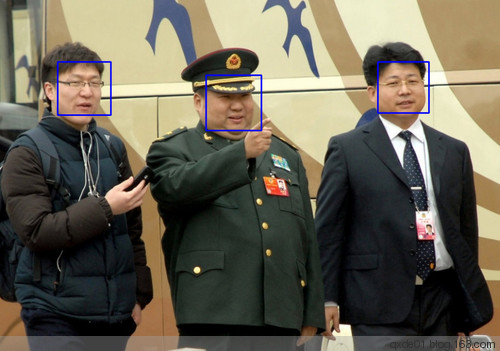
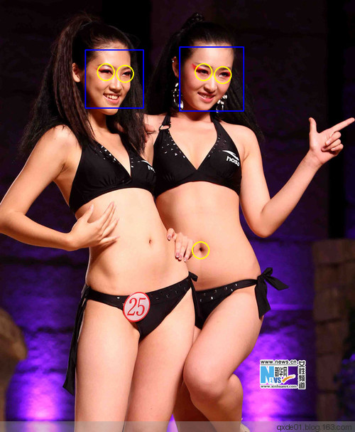

【从网易博客迁移，本文写于2012年8月】

最近开始接触 [OpenCV(Open Source Computer Vision Library)](http://opencv.org/) ，OpenCV对于图像处理已经十分强大，对于一些常见的应用仅用短短几行代码即可实现。官方释放的Python语言接口有两个cv2.cv和cv2，cv2加载的图像数据类型是Numpy类型，可以直接用Numpy处理，而cv2.cv的数据类型是OpenCV类型的。第三方的pyopencv也不错。 
<!--more-->
使用cv2.cv对人脸识别的代码如下，使用的是已经训练好的二分类模型( haarcascade\_frontalface\_alt为人脸分类模型， haarcascade_eyes为人眼分类模型 )，利用haar级联分类器( HaarDetectObjects )进行预测， 函数 HaarDetectObjects 使用针对某目标物体训练的级联分类器在图像中找到包含目标物体的矩形区域，并且将这些区域作为一序列的矩形框返回。函数以不同比例大小的扫描窗口对图像进行几次搜索； 影响效果的主要有两个参数： scale_factor和 min_neighbors。

> scale_factor： 在前后两次相继的扫描中，搜索窗口的比例系数。例如1.1指将搜索窗口依次扩大10%。
> min_neighbors： 构成检测目标的相邻矩形的最小个数 在前后两次相继的扫描中，搜索窗口的比例系数。

```py
import  cv2.cv as cv  
image = cv.LoadImage( "mm10.png" )  
image_size = cv.GetSize(image)  
grayscale = cv.CreateImage(image_size,  8 , 1 )  
cv.CvtColor(image, grayscale, cv.CV_BGR2GRAY)  
storage = cv.CreateMemStorage( 0 )  
cv.EqualizeHist(grayscale, grayscale)  

cascade=cv.Load( "haarcascade\_frontalface\_alt.xml" )  
#cascade=cv.Load("haarcascade_eyes.xml") 
faces = cv.HaarDetectObjects(grayscale, cascade, storage,  1.08 , 5 , cv.CV\_HAAR\_DO\_CANNY\_PRUNING,( 12 , 12 ))  

 if  faces:  
     for num in  faces:  
        i,j,width,height=num\[ 0 \]  
        cv.Rectangle(image,(i,j), (i + width, j + height),cv.CV_RGB( 0 , 255 , 0 ), 1 , 8 , 0 )  

cv.NamedWindow ( 'camera' , cv.CV\_WINDOW\_AUTOSIZE)  
cv.ShowImage( 'camera' , image)  
#cv.SaveImage('mm07.jpg', image) 
cv.WaitKey( 0 )  
```
效果如下图：


cv2.cv使用load加载分类模型（xml文件，类似数据挖掘的pmml），而cv2使用级联分类器 CascadeClassifier加载，其目标识别使用 图像的多尺度检测函数 detectMultiScale，其影响参数与 cv.HaarDetectObjects相同。其人脸识别代码如下：
```py
import  cv2  
image=cv2.imread( 'mm10.png' )  
cascade=cv2.CascadeClassifier( "haarcascade\_frontalface\_alt.xml" )  
#cascade=cv2.CascadeClassifier("haarcascade_eyes.xml") 
gray=cv2.cvtColor(image, cv2.COLOR_BGR2GRAY)  
gray=cv2.equalizeHist(gray)  
rects=cascade.detectMultiScale(image,scaleFactor= 1.05 ,minNeighbors= 8 ,minSize=( 4 , 4 ))  
for x,y,width,height in  rects:  
    cv2.rectangle(image, (x,y), (x+width,y+height), ( 255 , 0 , 0 ), 2 )  
    #cv2.circle(image, (x+width/2,y+height/2), 20,(0,255,255), 2) 
    cv2.imshow( 'facedetect' , image)      
    #cv2.imwrite( 'mme10.png' ,image)  
cv2.waitKey( 0 ) 
```
效果如下（有亮点）：



