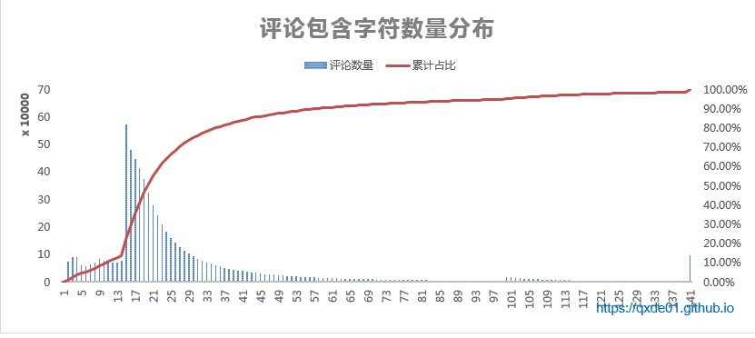
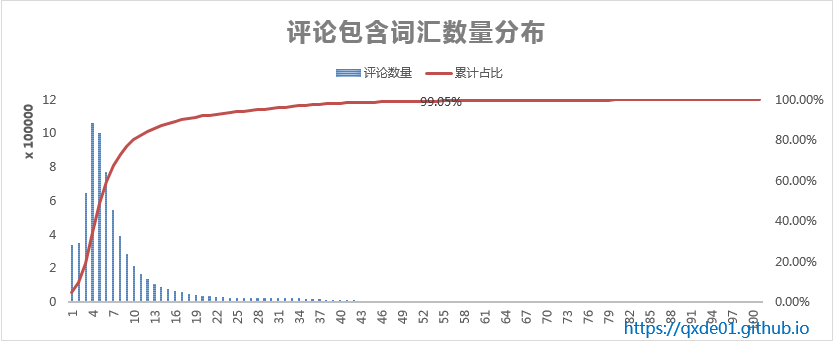
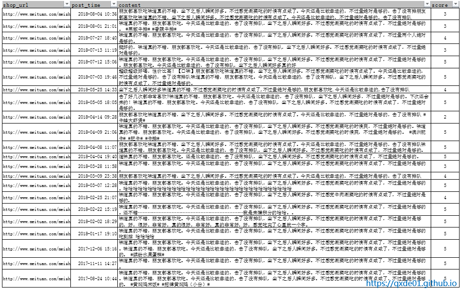
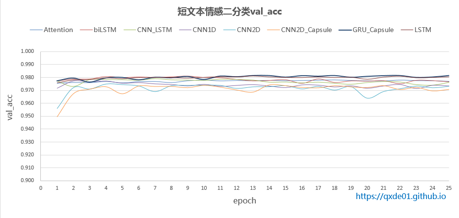
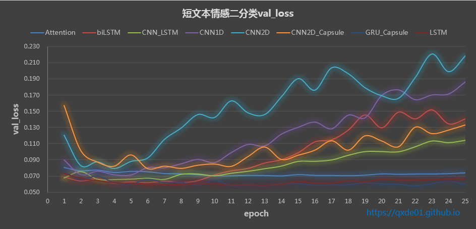
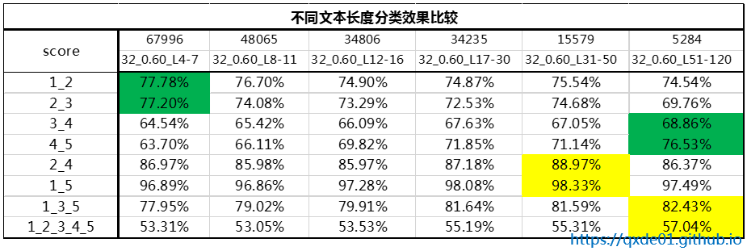
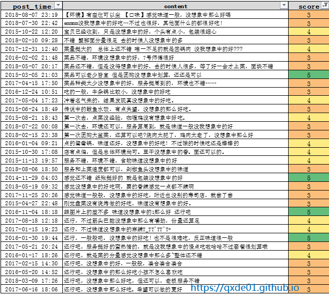

>对于正负面的情感分类，使用目前的深度学习算法,得到val_acc=95%以上的结果是非常容易的；但对于5类情感分类就没那么简单了，本文主要探索短文本评论5分分类，其中评分3、4、5的文本最难区分。
<!--more-->

### 1 数据获取 
数据主要来自美团、糯米等网站的评论，约700万条评论，其中餐饮类最多，包含1分评论约29.5万，2分41万，3分109万，4分158万，5分361万。

### 2 数据预处理
*  **扩展词库**：按照标点符合分割文本，统计句子频率，将长度低于6的短句作为新词加入到分词词库中，比如味道不错、上菜速度快、椰果奶茶等常用评论短句，不少属于菜名。当然，统计之后需要人工稍微修正一下。
*  **火星文**：火星文实际上是非常有用的，也是情感表达的一种方式；但是，本文用的是jieba分词，需要支持字符分词的话，需要修改jieba的源码才可以，本文并将火星文清洗掉了。另外，[HanLP库](https://github.com/hankcs/HanLP)是可以支持特殊字符分词的，只需将字符加到扩展词库即可，因为HanLP是java开发的，模型库非常大，所以本文仍采用轻便的jieba。
*  **词向量训练**：将文本按照`"。|\r|\n"`切割，切割后无重复的句子大约760，作为词向量训练的语料，使用fasttext的skipgram模型训练，维度为128。

### 3 文本长度
61%的评论文本长度介于15~20之间，分词之后，词汇个数介于4~10之间的文本也占61%。文本长度对模型有一定的影响。

### 4 文本相似度
在评论中会经常出现这种情况：同一个或相似的评论，不同的用户可能给出不同的评分，尤其是截然相反的评分。对于这类数据可以清除掉或者选择评分最多的那个类别，否则模型训练会非常困惑。另外，疑似刷评的直接去掉，如下图。

本文使用python库 [datasketch](https://github.com/ekzhu/datasketch/)计算相似度，datasketch提供了MinHash、MinHashLSH、LSHForest等hash算法。hash相似度虽然比单纯的词向量计算相似度高效不少，但是对于超过百万的数据，扫描一遍所有文本的相似度，仍然可能需要几天的时间。
如果不计算相似度，只去除相同的评论，可去掉90万的数据，其中包括4分、5分的数据81万。

### 5 情感二分类
评分为1的为负面、评分为5的为正面的二分类，选取词汇个数25~100之间的文本作为测试，每类样本61234，训练和测试比例为0.8:0.2，大多数深度学习模型都能得到很好的效果，下图所展示的8种模型的val_acc都在97%以上，其中最好的是GRU_Capsule，其次是biLSTM和LSTM，都可以达到98%，其实fasttext也不必这些模型差，可以作为基准线比较。

### 6 情感多分类

>表说明：
* 第一行表示每类样本数
* 第二行MinHash清洗参数和文本词汇数量，比如32_0.60_L4-7，清洗MinHash的num_perm为32、相似度大于0.60的文本，L4-7表示文本词汇数量在4~7之间
* 第一列表示不同评分分类，比如1_3_5即评分为1、3、5的文本三分类
* 模型为GRU_Capsule，参数相同

从上表看，5分类效果只比随机稍微好一点，文本越长，区分度约好；其中3、4、5区分度最差，文本越短越差，尤其是主题多个，有褒有贬，不同的用户侧重点不同，虽然相近的评论，但给出的评分差别很大。对于1、3、5差中好三类也只有80%左右的准确率，2、4分类可以达到85%以上的准确率。

### 7 小结
* 文本长度和分类效果有一定的关系，越短的文本所表达的含义有限，可能和对应的评分不符合
* 文本相似度和分类效果也有关系，相似的文本被标注为多个类别，严重干扰模型
* 对于词汇不超过10个的文本，用32-0.60比64-0.60多清洗25%的数据
* 在模型中使用dropout，设置不同的值对结果非常敏感
* 多读读原文，对理解模型表现为什么那么差是非常有帮助的

** 本文相关代码和数据：https://github.com/qxde01/sentiment_classify **