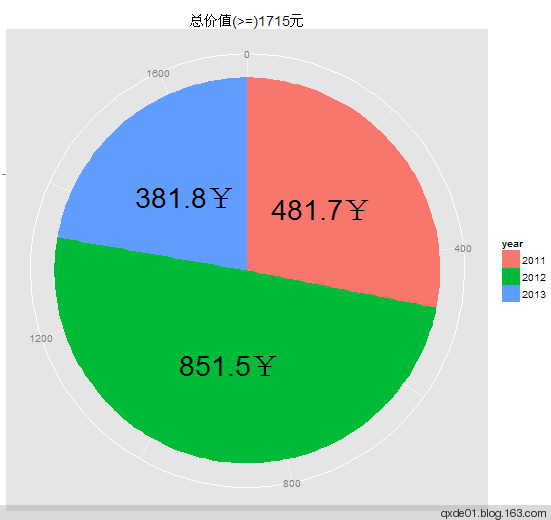
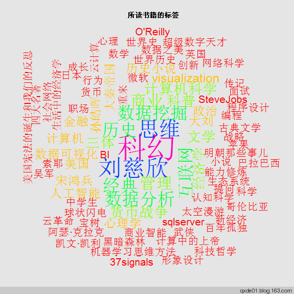
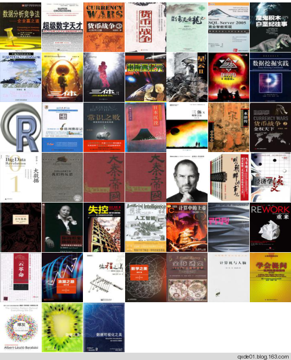
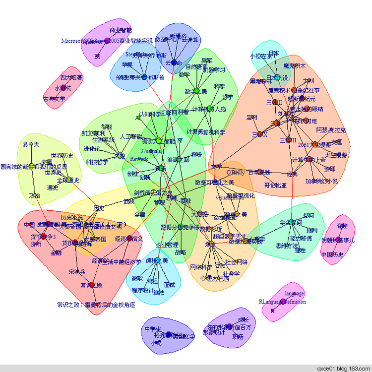
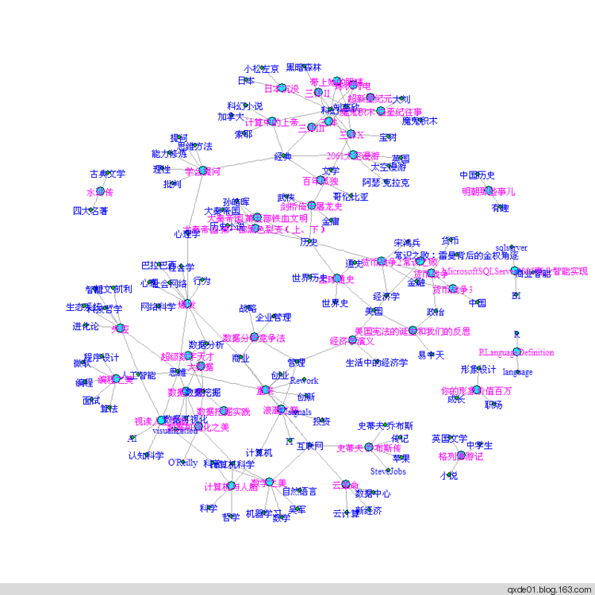

【原文上下两篇，现在合在一起，大多数代码不能运行了】
许多阅读过的书籍早已抛掷九霄云外了，毫无印象。后来在豆瓣上断断续续做了些记录，直至2012年后半年开始做不间断的记录。即使记录书名，也可以帮助自己回忆阅读内容，建立不同书籍之间的关系，进而形成系统化的知识。久而久之，理解能力和思考能力都能得到非常大的提高，进入一个全新的领域的学习曲线也会越来越短。正所谓，阅读越多，越感觉知之甚少，促使自己多读书多思考，使自己不懈怠。为了梳理阅读过的书籍，使用可视化的方法更直观，在这里做一些简单的尝试。记录的东西越多，帮助越大，可分析的内容也就越多。
<!--more-->
*   **数据获取**

对数据可视化的第一步当然是获取原始数据，然后才能做数据结构化、数据分析、可视化等一系列的工作。为此，编写了一个简单的获取豆瓣数据的R包：[Rdouban](https://github.com/qxde01/Rdouban)，**由于反爬虫的进击，此包已不可用**。 
其中 user_book_status 函数是根据豆瓣用户的昵称获取自己的读书列表、标签、评论、读书笔记等信息。后面所使用的数据主要基于此函数获取的。比如获取本人的读书信息如下：

```r 
qxde <-user_book_status(userid='qxde01' , verbose = TRUE ) 
```

返回的结果：
*   collect_tags:data.frame,已读书籍的标签
*   collect_df:data.frame,已读书籍的信息
*   do_tags:data.frame,在读书籍的标签
*   do_df:data.frame,在读书籍的信息
*   wish_tags:data.frame,想读书籍的标签
*   wish_df:data.frame,想读书籍的信息
*   reviews:data.frame,发表的书评
*   notes:data.frame,发表的读书笔记
*   collect_images:list,已读书籍的封面图片,分辨率为60x80

函数`user_book_viz`是对`user_book_status`产生的数据的统计分析和可视化，包括下面的统计（不完全）：  

*   **阅读统计**
 包括阅读概要统计、按月统计、按页数统计，概要统计如下图：
 - 平行宇宙")

*   **书籍价格统计**

根据书籍定价，统计每年的价格总和。此处使用饼图显示。在 collect_df中 包含了作者、出版社、定价等信息，将其中的价格提取出来。不过有的书籍并没有价格，比如开源社区的免费书籍，需要做特殊处理。处理过程及饼图绘制如下：
```r
collect_df <- qxde$collect_df  
price <- as.numeric(collect_df$price)  
p_df <- data.frame(price = price,year = substr(collect_df$reading_date,1,4 ))
py <- tapply(p_df$price,p_df$year,sum,na.rm  = T)  
price_df <- data.frame(money = py,year = factor(names(py)))  
price_df <- price_df[price_df$money >0 ,]  
##所读书籍定价饼图  
pie<-  ggplot(price_df, aes(x  = "" ,y = money, fill  = year))  + 
   geom_bar(stat = "identity" ,width  = 1 ) +
   geom_text(aes(y  =  money / 2   +  c(0 , cumsum(money)[-length(money)]),label  = paste0(money,'￥')),size= 10)  
pie  +  coord_polar(theta = "y" )+ labs(x ='',y = '' ,title = paste0('总价值(>=)',sum(price,na.rm = T),'元')
```


*   **标签云**
一般情况下，每阅读一本书，都会设定一些标签，代表这本书的类型。在获取到的数据list（上述数据名称qxde）中有一个元素名称为个 collect_tags 的data.frame，它是所有阅读过书籍的标签及其使用频率。此处使用包 wordcloud 绘制标签云图，从下图可以看出，我阅读比较多的是科幻、数据分析、计算机、历史类。代码如下：
```r
 library(wordcloud)  
 collect_tags <- qxde$collect_tags  
 par(bg ='gray90' )  
 wordcloud(words = collect_tags$tag_label, freq = collect_tags$tag_freq, min.freq = 1 ,  
           random.order = F,scale = c(5,1.5 ), ordered.colors = F,  
           colors =rainbow(length(table(collect_tags$tag_label))))  
title(main = paste0( '所读书籍的标签' ))
```


*   **封面缩略图拼接**

豆瓣上大多数书籍都有一个封面图，其中 collect_images是60X80的缩略图 ， 然使用 EBImage的 combine 函数合并图像，代码如下：
```r
library(EBImage)  
img <- combine(qxde$collect_images)  
display(img , method = "raster" , all = T )
```



*   **书籍之间的图关系**
从 collect_df中 提取出书籍名称与对应的标签，并将之转化为两列 “ 书名->标签 ” 的 data.frame . 使用igraph包绘制书籍、标签之间的关系图。上图为利用随机漫步社区发现方法 walktrap.community 绘制，下图利用力学导向的 fruchterman.reingold算法绘制。两个图形中，节点大的为书籍名称，小的为标签。其中科幻类书籍比较集中，主要为大刘的作品，一类为政治经济类，一类历史类，其中数据分析、计算机及周边的学科这一类是重点，因为和所学专业和从事的工作相关。
```r
.todf <- function (x){
 x <- as.character(x)
 x <- gsub('tag','',c(x[1],x[2]))
 left = x[1]
 right <- unlist(strsplit(x[2],' '))
 right <- right[nchar(right) > 0 ]
 right <- right[right != left]
 left <- rep(left,length(right))
 cbind(left,right)
 }
tag_list <- apply(collect_df[,c( “title” , “user_tags” )],1,.todf)
n = length(tag_list)
tag <- c()
 for (i in 1:n){
 tag <- rbind(tag,tag_list[[i]])
 }
 require(igraph)
 g <- graph.data.frame(tag,directed = F)
 title <- unique(collect_df$title)
 col = rep( 2 ,length(V(g)$name))
 col[match(V(g)$name,title)] <- 4
 vcex = col;vcex[vcex == 4 ] = 1.2 ;vcex[vcex == 2 ] = 1
 wc = walktrap.community(g)
 par(mar = rep(2 , 4 ))
 plot(wc,g,vertex.label = V(g)$name,vertex.size = col,edge.arrow.size = 0.5 )
 ### 力学导向的fruchterman.reingold关系图
 plot(g, layout = layout.fruchterman.reingold, vertex.size =col,vertex.label.dist =0, vertex.color =col+1,
 edge.arrow.size = 0.5 ,vertex.label = V(g)$name,vertex.label.cex = vcex,vertex.label.color = col + 2 )
```



*   **书籍页数统计**
 对 collect_df中的时间、页数进行处理， 并按月计算页数之和，注意有些书籍没有页数信息，无法计算在内，以缺失值NA处理， 使用ggplot2绘制树状图如下：
```r
pages <- as.integer(gsub('[页 ]','',collect_df$pages))
pg_df <- data.frame(collect_df$title,pages,
month = substr(collect_df$reading_date, 1 , 7 ),
year = substr(collect_df$reading_date, 1 , 4 ))
pg_s <- tapply(pg_df$pages,pg_df$month,sum,na.rm = T)
pg_sdf <- data.frame(pages =pg_s[],month = names(pg_s),year = substr(names(pg_s),1,4))
ggplot(pg_sdf, aes(x = month, fill = year,colour = pages)) +
geom_bar(stat ='identity', ymin = 0 , aes(y = pages, ymax = pages),position ='dodge') +
geom_text(aes(x = month, y = pages, ymax = pages,label = pages,hjust = ifelse(sign(pages) > 0 ,0.5, 0 )),
   vjust = -0.8 ,size = 6 ,colour ='blue' ,position = position_dodge(width = 1 )) +
labs(x ='年-月份' , y ='读书页数' ,title = paste0('总共阅读的页数(>=)',sum(pg_sdf$pages),'页'))
```
 - 平行宇宙")

实际上大多数书籍都在200～400也之间，300左右的最多：
```r
m <- ggplot(pg_df,aes(x = pages))  
m + geom_histogram(binwidth =  50 )  
m + geom_histogram(aes(y =..density..),fill = 3 ) + geom_density()+
   labs(x = '页数' , y = '概率密度' , title = '书籍页数分布' )
```
 - 平行宇宙")

*   **书籍分类**

（1） 根据书籍的内容简介信息，将相近的书籍划分为一类。首先将简介文本分词，分词过程如下：
```r
text.as.words<-function(x,stopwords=NULL){
   f_cut <- function(x){
    library(Rwordseg)
     unlist(strsplit(segmentCN(x,nature = T), ' '))
     }
  text<-gsub('<[^><]*.>','',x)
  words<-lapply(text,f_cut)
  words<-lapply(words,function(x){x[nchar(x)>1]})
   if(!is.null(stopwords)){
     words<-lapply(words,function(x){x[!x %in% stopwords]})
     }
   words<-sapply(words,function(x){paste(x,collapse=' ')})
   words
 }
 ###停止词
 data(stopwords)
 intro_word<-text.as.words(x=collect_df$summary,stopwords=stopwords)
```
（2） 使用tm包生成词频--文档矩阵（TermDocumentMatrix）：
```r
library(tm)
mybook<-data.frame(content=intro_word,title=collect_df$title,stringsAsFactors=F)
mybook<-mybook[nchar(mybook$content)>0,]
row.names(mybook)<-NULL
m <- list(Content = "content", ID = "title")
myReader <- readTabular(mapping = m)
corpus <- Corpus(DataframeSource(mybook),readerControl = list(reader = myReader,language = "zh_cn"))
tdm<-TermDocumentMatrix(corpus, control = list(wordLengths=c(2,Inf)))
```
（3）使用层次聚类方法对词频矩阵进行聚类，使用余弦相似度和ward方法：
```r
###利用余弦相似度和层次聚类划分类别
diss<-dissimilarity(tdm,method='cosine')
hc <- hclust(diss, method = "ward")
plot(hc,col=4, main="层次聚类",ylab='',xlab='',sub='')
 rect.hclust(hc,k=7, border = 2)
```
 - 平行宇宙")
如果分成7类，从上图可以看出效果一般，从左至右，效果越来越差，最右边的一类十分庞杂。考虑到这些词汇产生于书籍简介，有些就没有意义，比如去掉词汇"作者","这本","一本","这部","简介","本书","读者"7个词语，将产生不同的聚类效果优于上图，效果如下图：
 - 平行宇宙")

*   ** 关联分析**

如果将词语看成一个“购物篮的物品”，那么就可以用这些词语就组成一个项集，即一个事务数据集( transactions) ，这样可以用关联分析的方法探索词语之间的关联，从而可以了解书籍简介的内容。使用apriori算法分析如下：  
```r
library(arules)
library(arulesViz)
intro_words<-sapply(mybook$content,function(x) unique(unlist(strsplit(x,' '))))
names(intro_words)<-NULL
trans<-as(intro_words, "transactions")
itemsets<- apriori(trans,parameter = list(supp = 0.05, minlen=1,target = "frequent itemsets"))
```
可产生480个频繁项集，其中含二个词语的项集238个，三个词语的项集77个。根据下面两个图形可以看出，我所阅读的书籍的主题大致可分为三类：中国历史、未来与太空（科幻）、计算机技术与商业（确切地说是和数据分析相关的技术及商业）。可以说是回顾过去、艰难地活在当下、满怀憧憬的面向未来和太空，真是杞人忧天。
```r
subset2<-itemsets[size(itemsets)>1]
subset2<-sort(subset2)[1:100]
subset3<-itemsets[size(itemsets)>2]
png('subset23.png',width=1000,height=500)
par(mfrow=c(1,2))
plot(subset2, method="graph",control=list(main="至少包含两个词语的前100个项集"))
plot(subset3, method="graph",control=list(main="至少包含三个词语的所有项集"))
dev.off()
```
 - 平行宇宙")

如果将几个代表性的词语提取出来，可以看出主题更加清晰，如下图，真是在担心人类的未来啊。
```r
subwords<-c('历史','中国','人类','宇宙')
subset4<-subset(itemsets,subset=items %in% subwords)
subset4<-subset4[size(subset4)>1]
subwords2<-c('科学','思维','技术','研究','数据','分析','信息')
subset5<-subset(itemsets,subset=items %in% subwords2)
png('subset45.png',width=1000,height=500)
par(mfrow=c(1,2))
plot(subset4, method="graph",control=list(main="历史与科幻"))
plot(subset5, method="graph",control=list(main="技术与思考"))
dev.off()
```
 - 平行宇宙")

**[Rdouban](https://github.com/qxde01/Rdouban) 阅读统计可视化函数使用方法：**

```r
library(Rdouban) 
qxde<-user_book_status(userid="qxde01") ##获取阅读数据 
data(stopwords)## 中文停止词 
## 生成用户qxde01的2013年阅读信息可视化图形 
user_book_viz(x=qxde,YEAR="2013",stopwords=stopwords,back=TRUE)
```
生成的图形包括以下内容：
 - 平行宇宙")
