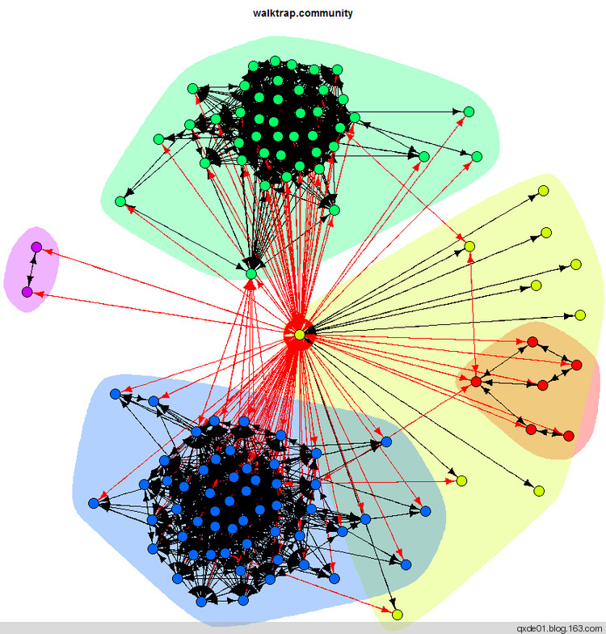
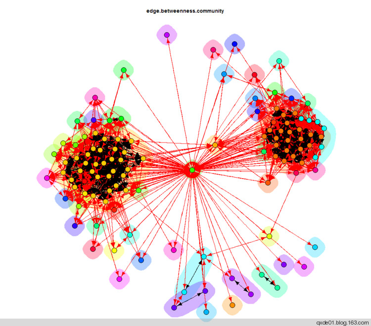

【原文上中两篇，现在合在一起】

社群或社区是这样一种组结构， 社群 内的边密度要高于 社群 间边密度。即 社群 内部的节点 之间的连接相对紧密，各社群之间的连接相对来说比较稀疏。在社会网络分析中，社区 经常被看作是一些凝聚子结构，如派系、群、组、块等。社群主要分为重 叠社群图和划分社群图两类，其中后者是 把网络中社区结构的发现看作是对整个网络的划分，目前已经有不少成熟的算法实现。社群发现的过程实际上是一个节点群组过程，许多方法都离不开聚类方法。
<!--more-->
*   随机漫步（ Random Walk ）

随机漫步是一种数学统计模型，它是一连串的轨迹所组成，其中每一次都是随机 的，它能用来表示不规则的变动形式， 通常假设随机漫步是以 马尔可夫链 或 马可夫过程 的形式出现的。 随机漫步社群发现的思想是假设一漫步者在一个社区（图）里随机游走，漫步者可能被困在连接稠密的区域里（想象一下初次进入一个道路错综复杂的街区），漫步者很容易被“困”（trapped）在里面，这个稠密区域就是漫步者发现的社群。根据图的属性，定义节点和社群之间的结构相似度进行度量漫步者的“行为”，这种相似度是一种可计算的、高效的距离相似度，这样就可以利用合并层次聚类方法建立社区的层次结构，也就是社区结构。可以利用从i点走向（连接，边）j点的概率定义距离相似度（概率距离），若i和j在同一社群里，概率相对比较高。这种算法最坏情况下的计算复杂度为O(mn^2)，m为图的边，n为图的节点。

在R:package:igraph的随机漫步社群发现函数为`cluster_walktrap`。在我的人人网好友关系网络进行随机漫步社区发现计算，发现5个社群，其中两个比较密集，代表不同的同学群体。整体效果是非常符合实际的。

*   自旋玻璃（Spin Glass）

[自旋玻璃](http://zh.wikipedia.org/wiki/%E8%87%AA%E6%97%8B%E7%8E%BB%E7%92%83) 是一个物理概念，是一些物理材料的一种状态，代表一种无序的状态。自旋玻璃模型可分为有限维系统、随机有限维连通系统和完全连通系统，如果把社会网络看成一个随机网络场，在一些假设条件下，社会网络可近似于随机有限维连通系统，就可以利用自旋玻璃模型的一些特性来发现和解释社群。对于网络中的一个节点，与其他节点的连接和缺省的连接可看作磁性材料的磁性相互作用和反磁性相互作用，两种相互作用形成一个能力函数，当能量函数最小时， 社会网络的层次结构被解释为旋转配置(spin con?guration )，此时 网络内部的组别（聚类）可看作自旋系统的状态，划分组别或网络层次的过程是一个i聚类过程。

在R:package:igraph的自旋玻璃社群发现函数为`cluster_spinglass`，其能量函数的求解使用了[模拟退火方法](http://zh.wikipedia.org/wiki/%E6%A8%A1%E6%8B%9F%E9%80%80%E7%81%AB)。在我的人人网好友关系中，利用此方法可发现三大社群，两个非常集中的社群，分别代表的是中学同学和大学同学，而第三个社群非常分散，是后来已经不怎么登录时断断续续加入的好友，这几个好友之间也分属几个小的团体。

 - 平行宇宙")

*   [Girvan–Newman 算法](http://en.wikipedia.org/wiki/Girvan%E2%80%93Newman_algorithm)

社会网络分析中的分层划分（Hierarchical Clustering，层次聚类）中的分裂法的做法是找出相互关联最弱的节点并删除它们之间的边，通过这样的反复操作将网络划分为越来越小的组件，也可以在任何时刻终止这个过程并将当时的结果作为社区结构，同样也可以用系统树描述这个将网络划分为越来越小的团队的过程。Grivan-Newman(GN)算法有些类似，GN算法是基于edge betweenness的算法。

边介(edge betweenness)被Newman定义为通过该边的节点之间的最短路径的条数，并且不同社区之间的边的介数(betweenness,betweenness centrality的简称??)值较高。该方法是通过不断地寻找并删除 边介值最高的边来得到社会网络中的社区结构的，称此算法为 GN 算法，其步骤为：

>- Step1：计算网络中每条边的 betweenness;
- Step2：删除 betweenness 值最高的边；
- Step3：重新计算所有边的 betweenness;
- Step4：重复 Step2- Step4 直到所有的边都被删除。

可以将 GN 算法看作是一种分裂法，不过与一般分裂法不同的是，GN 算法不是寻找关联最弱的节点对然后删除它们之间的边，而是寻找最“between”的边并删除它。通常一条边的删除会很大程度上影响到许多其它边的 betweenness 的值，因此，每次在执行完边的删除之后，必需重新计算所有边的 betweenness 值。这是一个非常耗时的任务，为此，Brandes和Newman分别给出了一种快速重新计算边介的方法。
该方法的基本思想是：选择一个节点作为中心节点(Center)，只考虑中心节点和其它节点之间的最短路径，计算每条边由当前这些最短路径得到的 betweenness 值，并将计算结果添加到当前该边的 betweenness 和中。然后，改变中心节点，即选择另外一个节点作为中心节点，并重复刚才的计算过程直到每个节点都曾被选中作为中心节点为止。因为在刚才的计算过程中，每条最短路径的端点都被计算过两次，计算得到的每条边的 betweenness 的和正好等于该边准确的 betweenness 的两倍。
在R:package:igraph的基于边介的Grivan-Newman社群发现算法实现函数为`cluster_edge_betweenness`。在我的人人网好友关系中，可以很好地发现两大密集的社群，其余的比较散乱地分布在周围。

*   标签传播算法

标签传播(label propagation)算法是一种近线性算法，其复杂度只有O(km)，k为迭代次数，通常情况下k<<m，通过5次迭代95%的节点可以够达到最终类别。算法的基本思想是：每个节点的社群归属即标签由相邻节点的标签决定，相邻节点的最大数的标签即为该节点的标签；可以理解为由邻居投票，和票数多的在一起。初始化时，给每个节点一个独特的标签（类似层次聚类合并算法的初始化），通过标签的传播，密集连接的节点对一个特殊的标签迅速达成共识，这些密集的节点迅速的扩张，直至这些具有相同的标签的节点组成一个社群。这个过程通过迭代完全，同步迭代方式只依赖于上一轮的迭代，异步迭代方式还包含已经更新完成的节点。但是，此算法不保证收敛，需要添加一些限定条件才能保证收敛，一种简单的方法是迭代几次之后随机地断开。如果初始化时，事先标注一些社群的中心节点，是一种不错的方法。

在R:package:igraph的近线性的标签传播社群发现算法实现函数为`cluster_label_prop`，该函数使用节点的权重作为限制条件，其初始化参数initial可以设定节点的标签。在我的人人网好友关系中，在没有限定任何条件下，只能发现两大社群，对于小型社群无法识别。

 - 平行宇宙")
