【从网易博客迁移，本文写于2013年6月】

有一天突然想到一个问题：
*   领导人的脸都有哪些特征？
*   与普通人有什么不同之处?
*   领导人之间的脸有多大的相似度?
*   其他人的脸可以由领导人的脸的特征组合吗？
然后进行了一番求索，本文主要用R语言分析，用到的包(package)有RCurl、XML、jpeg、EBImage、fastICA、spams、ttutils。
<!--more-->
**声明：本文纯属娱乐和技术学习，没有任何实际意义和有价值的结论。**

**1 .** 数据获取

本文用到的领导人都来自 [中国政府网](http://www.gov.cn/test/2013-03/14/content_2353702.htm) 和 [中国政协网](http://www.cppcc.gov.cn/zxww/zxww/zx/index.shtml) ，不看比不知道，一看才知道，在现任领导人中，国家级领导人有57位。将图片抓取之后，统一转化为96×128的小图像，然后用OpenCV的harr级联分类器CascadeClassifier（使用方法见 [前文](http://qxde01.blog.163.com/blog/static/6733574420127253290406/) ）把人脸提取出来，人脸大小为48×48。另外从网络上选取25张脸作为测试，有些人图片到处都是，但没有一幅严肃的正脸，比如苍老师。

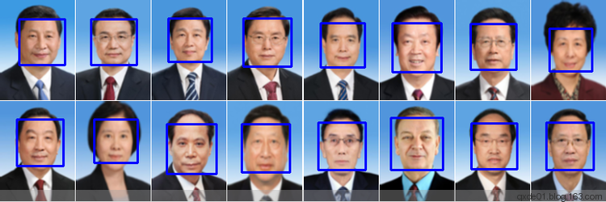

****2\. 平均脸****

首先计算一下这57位领导人的平均脸，顺便算一下中值、四分之一分位数、四分之三分位数、标准差、中值绝对偏差（MAD）是什么样子。如下图，分别是1/4分位数、平均、中值、3/4分位数、标准差、MAD，从发型看，中值脸比平均脸稍暗，最后的两幅鬼脸纯粹为了好玩。

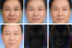

计算一下各位领导人和平均脸、中值脸的均方误差和余玄相似度，分布是下图的样子，越靠近左下角，差异越小，具体就不表了。难道这个也遵循中庸之道，既不能太近，也不能太远？

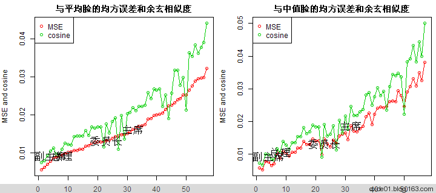

**3\. SVD重建**

使用 [SVD](http://zh.wikipedia.org/wiki/%E5%A5%87%E5%BC%82%E5%80%BC%E5%88%86%E8%A7%A3) 对灰度图进行求解，使用最大的两个特征值对人脸进行重建，这样可以消除低秩的影响，保留最主要的特征。重建误差平方和与特征值散点图是下面的样子。散点图是不是有明显的聚集现象？

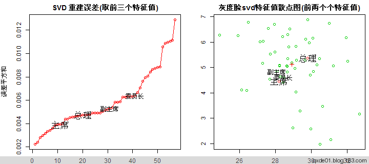

将另外25幅测试脸放在一起，其特征值散点图如下，马云相当有领导范。

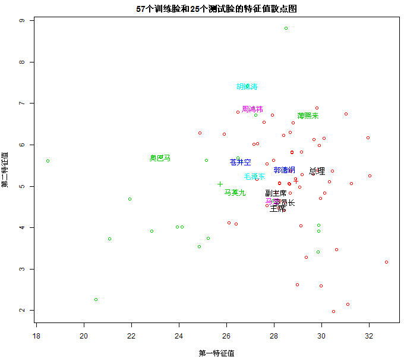

** 4\. ICA特征脸**

[ICA（独立成分分析）](http://en.wikipedia.org/wiki/Independent_component_analysis) 可以从混合信息中分离中独立的特征信息。使用 [fastICA](http://en.wikipedia.org/wiki/FastICA) 对人脸进行训练，注意fastICA会对数据进行白化（whiten），选取20个独立成分（对应于前20个PCA，>95%），化成人形就是下面的各种幽灵。

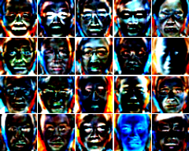

使用这20个特征对原图和25张测试脸进行重建，不可思议的是东条英机和蒋介石的重建误差最小，而伟大的民主先行者孙中山先生在另一端，还不如马云。

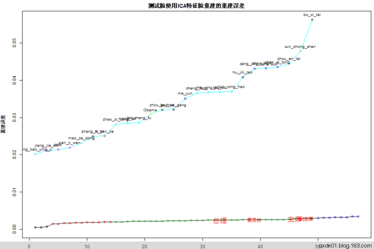
 
**5\. NNSC重建**

[稀疏编码（Sparse Coding）](http://deeplearning.stanford.edu/wiki/index.php/%E7%A8%80%E7%96%8F%E7%BC%96%E7%A0%81) 是 一种模拟哺乳动物视觉系统主视皮层V1区的视觉感知算法， NNSC（Non-Negative Sparse Coding，非负稀疏编码）是SC和非负矩阵分解相结合的一种编码算法。

 对57个训练样本的每一幅图片随机抽样1500个4×4个图像小块，4×4可显示一个眼的余角，4×4比8×8精确的多，使用NNSC训练，取256个特征，256个特征集合应该是一个超完备的特征集，关于特征数选择，我曾见过两种方式，一种是n*(n+2),n是块的大小，一种是spams的参考论文，10万个数据大约训练200个特征。4×4太小，肉眼难以分辨，放大后显示如下，有不少相似的特征。

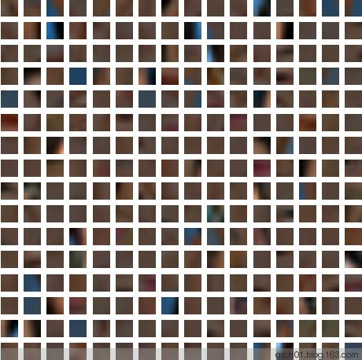
 
使用这256个特征对57+25=82个脸进行重建，重建误差如下，在训练集中，中庸之道更加明显！做IT的大佬都很有领导范，周鸿祎靠近马英九和奥巴马。李连杰可能是因为做过中南海保镖吧。章子怡不可解。

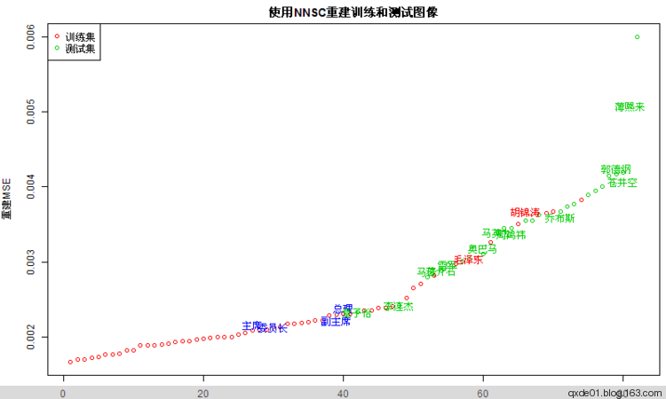

 注意 ，重建图像没有使用随机采样，因为在重建图像时运算速度非常慢，没找到快速运算的办法，所以采用顺序分割的办法，重建后的图像视觉上有明显的块状区域。最后来一幅NNSC重建后图像的全家福。

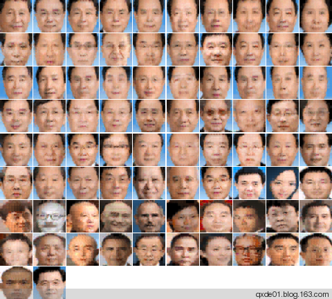

使用NNSC训练128个特征时，重建误差和256个特征差异不大，使用稀疏系数进行层次聚类，训练数据和测试数据差异还是比较明显的，这一次潘基文可以领导中国人民了。

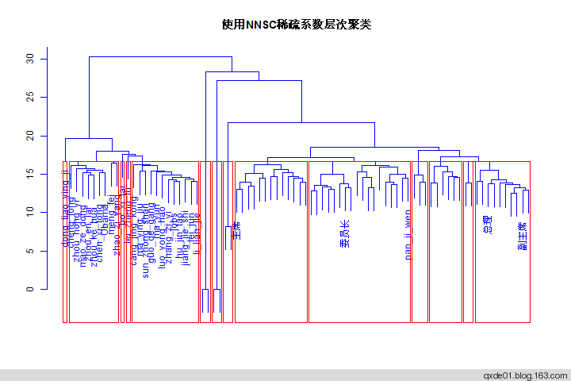

**说明：**

*   SVD、ICA、NNSC三个分析是相互独立的，结果有差异甚至有矛盾是正常的，这三种方法都可用于人脸识别、图像去噪、重建等应用
*   通过SVD计算，大多数人脸的第一特征值在30左右（48×48），理论上去掉低秩（小特征部分），可以去掉一些干扰
*   ICA可以分离出独立的信息，其特征比PCA鲁棒
*   作为SC家族的NNSC，常用于字典学习，字典基元（小块特征）是自主学习得到的，在重建图像上比ICA精确的多
*   训练集图像整齐划一，而测试图像各种类型都有，背景干扰大，有些是黑白的比如东条英机，不知是画像还是照片
*   训练图像的人脸是OpenCV提取的，对脸的覆盖面相对统一，而测试图片纯手工打造
*   大多数人脸的相似度都比较高，图中第一特征值在从18～33之间变化，可能是图像背景、提取人脸的实际面积的影响
最后的最后给出详细代码和图像： [github](https://github.com/qxde01/myRproj/tree/master/face)
